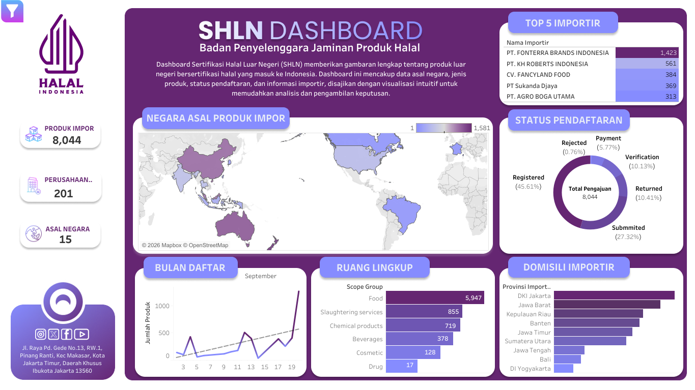

## 📊 SHLN Dashboard — Halal Product Certification (International)

This project presents an interactive dashboard analyzing internationally certified halal products entering Indonesia, developed using Tableau.

The dashboard provides a comprehensive overview of the **Sertifikasi Halal Luar Negeri (SHLN)** ecosystem, enabling users to explore product origin, certification status, product categories, and importer information.

### 🔍 Key Features

* Country of origin analysis for imported halal products
* Product category distribution
* Certification and registration status tracking
* Importer-level insights

### 🌍 Dashboard Access

👉 https://public.tableau.com/app/profile/rowahul.muslim/viz/SHLN_Dashboard/Dashboard3

### 🎯 Objective

To support data-driven monitoring and decision-making in halal product regulation and international trade by transforming complex certification data into intuitive visual insights.

### ⚠️ Data Note

The data used in this dashboard is **synthetic and adapted to reflect realistic conditions**, ensuring no sensitive or confidential information is disclosed.
